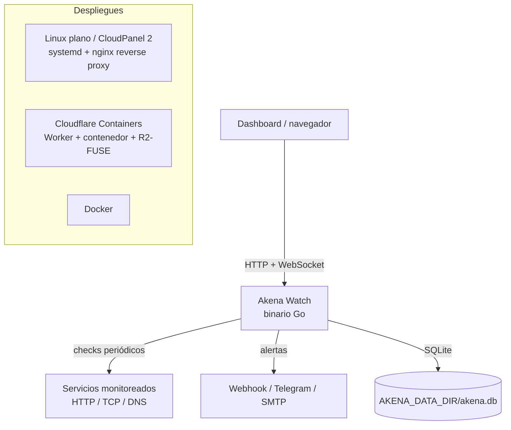
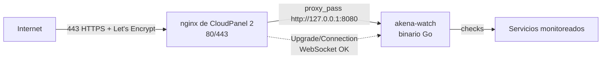
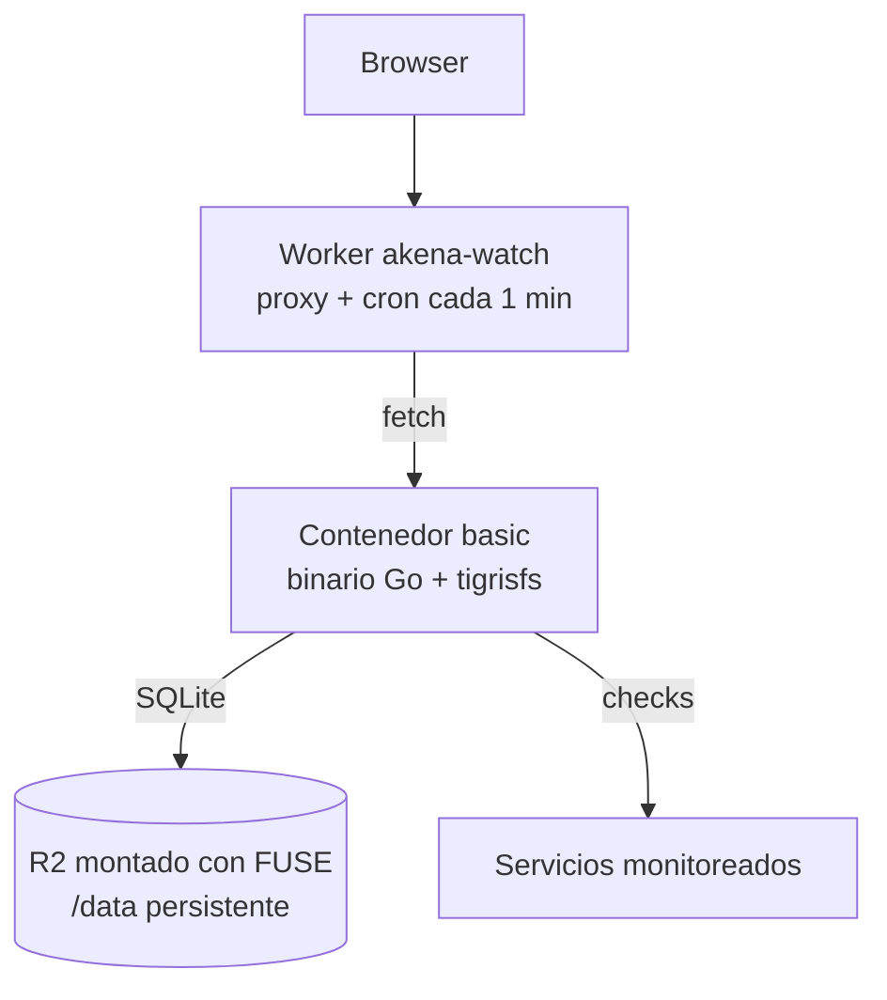

# Akena Watch — Siempre en Guardia

Monitor de disponibilidad (uptime) **portable**: un solo binario, SQLite embebida,
cero dependencias de runtime. Corre en **cualquier Linux**, detrás de un panel
como **CloudPanel 2**, o en **Cloudflare Containers** — con el mismo ejecutable.

> 🐾 **En memoria de Akena.** Este proyecto nace como tributo a una compañera
> mestiza que, durante más de nueve años, fue guardiana y familia. Su nombre vive
> en cada monitor, cada heartbeat y cada alerta: la misma fidelidad con la que
> ella cuidó a los suyos es la que este vigilante dedica a tus servicios.
> *Siempre en Guardia.*

---

## Contenido

1. [Características](#características)
2. [Arquitectura](#arquitectura)
3. [Requisitos](#requisitos)
4. [Inicio rápido](#inicio-rápido)
5. [Primer arranque: crear el administrador](#primer-arranque-crear-el-administrador)
6. [Usuarios y roles](#usuarios-y-roles)
7. [Monitores](#monitores)
8. [Canales de alerta](#canales-de-alerta)
9. [Página de estado pública](#página-de-estado-pública)
10. [Herramientas](#herramientas)
11. [Configuración](#configuración)
12. [Despliegue](#despliegue)
    - [Linux plano (systemd)](#linux-plano-systemd)
    - [CloudPanel 2](#cloudpanel-2)
    - [Cloudflare Containers](#cloudflare-containers)
    - [Docker](#docker)
13. [API](#api)
14. [Seguridad](#seguridad)
15. [Limitaciones conocidas](#limitaciones-conocidas)
16. [Desarrollo](#desarrollo)
17. [Roadmap](#roadmap)
18. [Licencia](#licencia)

---

## Características

- **Primer arranque con wizard**: la primera ejecución pide crear el usuario y
  contraseña del **administrador**; hasta entonces todo redirige a `/setup`.
- **Multi-usuario**: el administrador crea **administradores** y **colaboradores**.
  Cada usuario tiene sus **propios monitores** y canales de alerta.
- **Compartir monitores** con otros usuarios (lectura o edición).
- **Checks**: HTTP/S (método, estado esperado, palabra clave, invertir keyword),
  TCP (host:puerto) y DNS.
- **Scheduler** con intervalo por monitor (desde 10 segundos), ejecución en
  goroutines y reintentos antes de alertar (evita falsos positivos).
- **Historial** de heartbeats en SQLite con cálculo de **uptime** (24 h y 7 días).
- **Resumen estadístico** en el dashboard: en línea, caídos, pausados, sin datos y
  uptime medio de 24 h.
- **Gráficas de latencia** (últimas 24 h) por monitor, dibujadas en SVG sin librerías.
- **Tiempo real**: el dashboard se actualiza por WebSocket sin recargar
  (estado, latencia, gráfica y resumen).
- **Alertas** por webhook genérico, **Telegram** y **email SMTP**, con botón de
  **prueba por canal** para validar la configuración.
- **Herramientas**: sección de utilidades que se ejecutan desde el servidor —
  **ping en tiempo real** (TCP o ICMP, con estadísticas y gráfica), **whois**
  y **DNS lookup** (A, AAAA, CNAME, MX, NS, TXT, PTR).
- **Página de estado pública** por usuario, sin autenticación, con **historial
  visual de las últimas 24 horas** por monitor.
- **Un solo binario**: el frontend está embebido (`go:embed`); no hay
  `node_modules`, ni pasos de build del frontend, ni dependencias de runtime.
- Idioma de la interfaz: español.

## Arquitectura



| Capa | Tecnología |
|---|---|
| Lenguaje | Go 1.23 (binario estático, sin cgo) |
| Persistencia | SQLite embebida (`modernc.org/sqlite`, pure Go) |
| HTTP | `net/http` estándar (Go 1.22+ routing) |
| Tiempo real | `gorilla/websocket` |
| Frontend | HTML + CSS + vanilla JS embebidos (sin toolchain) |
| Contraseñas | bcrypt (`golang.org/x/crypto`) |

## Requisitos

- **Go 1.23+** solo para compilar desde el código fuente (los binarios
  publicados en Releases no necesitan nada).
- Cualquier **Linux x86_64 o arm64** para ejecutar.
- Para el despliegue en Cloudflare: cuenta con plan **Workers Paid** y `wrangler`.
- Docker solo si usas la imagen de contenedor.

## Instalación para nuevos usuarios

Los binarios se publican como **GitHub Releases** (linux y darwin, amd64 y
arm64) con su checksum. Una sola línea:

```sh
AKENA_REPO=xic17/akena-watch sh -c "$(curl -sSL https://github.com/xic17/akena-watch/releases/latest/download/install.sh)"
```

> El script detecta la plataforma, descarga el binario correcto, **verifica
> el checksum** e instala en `/usr/local/bin/akena-watch`. También puedes
> ejecutarlo desde el repo (`sh scripts/install.sh`) o fijar versión:
> `VERSION=v1.0.0`.

Alternativas:

```sh
# manual: descarga desde Releases
curl -sSL -o akena-watch https://github.com/xic17/akena-watch/releases/latest/download/akena-watch-linux-amd64
chmod +x akena-watch
./akena-watch

# o desde el código fuente
make build-linux-amd64
./bin/akena-watch-linux-amd64
```

Comprueba la versión instalada: `akena-watch` imprime la versión al arrancar,
y `GET /api/version` la expone por HTTP.

## Inicio rápido

```sh
# compilar
make build            # o: CGO_ENABLED=0 go build -o bin/akena-watch .

# ejecutar (datos en ./data, puerto 8080)
./bin/akena-watch
```

Abre `http://localhost:8080` → te lleva a `/setup`.

También puedes compilar para cualquier objetivo sin instalar nada en el destino:

```sh
make build-linux-amd64   # VPS x86_64 (CloudPanel, etc.)
make build-linux-arm64   # Raspberry Pi / ARM
```

## Primer arranque: crear el administrador

Con cero usuarios en la base de datos, **todas** las rutas redirigen a `/setup`:

1. Entra en `http://servidor:8080/setup`.
2. Crea el primer **administrador** (usuario + contraseña, mínimo 8 caracteres).
3. Quedas autenticado y aterrizas en el dashboard.

El wizard desaparece para siempre: una vez existe el primer usuario, `/setup`
devuelve error y todo pide login.

## Usuarios y roles

| Rol | Gestiona usuarios | Monitores |
|---|---|---|
| **Administrador** | ✅ crear, editar (rol y correo), eliminar | Ve todos los monitores del sistema y posee los suyos |
| **Colaborador** | ❌ | Solo sus monitores y los que le compartan |

Cada usuario puede llevar un **correo asociado** (opcional): se pide al crear
el usuario (wizard y panel) y se puede editar después. Validado en formato y
**único** entre usuarios (los vacíos no cuentan). Queda listo para futuras
funciones como recuperación de contraseña o notificaciones por correo.

Reglas de protección:

- No puedes eliminarte a ti mismo ni quitarte el rol de administrador.
- **Siempre debe existir al menos un administrador** (protegido por la API).
- Eliminar un usuario borra en cascada sus monitores, historial, canales y
  comparticiones.

## Monitores

Cada monitor se define con:

- **Nombre** y **tipo**: `http` (URL completa), `tcp` (host:puerto), `dns` (host).
- **HTTP**: método, estado esperado (default 200), palabra clave opcional
  (buscar en el cuerpo, o alertar si *aparece* con "invertir keyword") y
  **cuerpo JSON opcional** que se envía en cada check (para APIs con
  POST/PUT/PATCH; se manda con `Content-Type: application/json`).
- **Intervalo**: desde 10 segundos hasta 24 horas.
- **Timeout**: 1–120 segundos.
- **Reintentos**: N fallos consecutivos antes de disparar la alerta (default 1).
- **Opciones**: activo, alertas habilitadas, público (página de estado),
  canales de notificación asociados.
- **Compartir** con otros usuarios: lectura o edición.

El botón **Probar** ejecuta un check manual sin guardar nada en el historial.

## Canales de alerta

Se configuran por usuario y luego se asocian a cada monitor (varios por monitor):

- **Webhook**: POST JSON a una URL. Por defecto envía `{"text": "..."}`, pero
  puedes definir un **cuerpo JSON personalizado** con variables (estilo Uptime
  Kuma) para alimentar sistemas como Slack, Discord, n8n o tu propia API:

  ```jsonc
  {
    "text": "{{monitorName}} está {{status}}",
    "url": "{{monitorUrl}}",
    "latency": "{{latency}}",
    "at": "{{localtime}}"
  }
  ```

  | Variable | Contenido |
  |---|---|
  | `{{monitorName}}` | Nombre del monitor |
  | `{{monitorUrl}}` | Destino monitorizado |
  | `{{monitorType}}` | `http`, `tcp` o `dns` |
  | `{{status}}` | `up` o `down` |
  | `{{msg}}` | Detalle del error (o "sin error reportado") |
  | `{{latency}}` | Latencia en ms (vacío si no aplica) |
  | `{{time}}` | Fecha/hora en UTC (ISO 8601) |
  | `{{localtime}}` | Fecha/hora local `DD/MM/AAAA HH:MM:SS` |

  Los valores se insertan escapados como JSON; si la plantilla no produce
  JSON válido, el envío falla con un mensaje claro.
- **Telegram**: bot token + chat ID (`sendMessage` con Markdown).
- **Email SMTP**: host, puerto, usuario, contraseña, desde, para.

Las alertas avisan en la **transición** de estado: caída (🔴) y recuperación (🟢),
con nombre del monitor, destino, detalle del error, latencia y hora.

## Página de estado pública

Cada usuario puede publicar una página sin autenticación en
`/status/<usuario>` con los monitores marcados como **público**:

- Configurable desde el dashboard (título + descripción).
- Muestra estado actual, latencia, uptime de 30 días, historial visual de las
  últimas 24 h y último check.
- Se refresca sola cada 30 segundos.

## Herramientas

Sección de utilidades que se ejecutan **desde el servidor**: miden tu
infraestructura desde donde corre Akena Watch, no desde el navegador.

### Ping en tiempo real

- **TCP** (por defecto): mide la latencia de conexión a `host:puerto`.
  Funciona en cualquier entorno sin privilegios (también en Cloudflare
  Containers).
- **ICMP**: echo clásico. Requiere permisos de ping en el sistema.
- Transmite cada paquete por WebSocket (`GET /ws/ping`): estadísticas en vivo
  (enviados/recibidos/perdidos, mín/media/máx, % de pérdida), gráfica y log.
  Si el error es permanente (p. ej. ICMP sin permisos), la sesión se detiene
  con un único aviso claro en lugar de repetir el fallo.

**Habilitar ICMP** (si el servicio corre como usuario sin privilegios, típico
con systemd, verás `permission denied`):

```sh
# Opción A (recomendada): habilita el ping para todos los usuarios y
# sobrevive a las actualizaciones del binario.
sudo sysctl -w net.ipv4.ping_group_range="0 2147483647"
echo "net.ipv4.ping_group_range=0 2147483647" | sudo tee /etc/sysctl.d/99-ping.conf

# Opción B: da capacidad de red solo al binario.
# ⚠️ Se pierde al actualizar el binario: hay que repetirlo.
sudo setcap cap_net_raw+ep /usr/local/bin/akena-watch
```

### Whois

Consulta el registro WHOIS de un **dominio o IP** desde el servidor
(`GET /api/whois?domain=...`), con la cadena de referencias IANA → registro →
registrador resuelta automáticamente. Muestra el texto completo del registro
en una vista desplazable, con botón para copiarlo, y timeout de 20 segundos.

### DNS Lookup

Consulta los registros DNS de un host desde el servidor
(`GET /api/dns?host=...&type=...`) usando el resolver del sistema:

| Tipo | Descripción |
|---|---|
| `A` / `AAAA` | Direcciones IPv4 / IPv6 |
| `CNAME` | Nombre canónico |
| `MX` | Servidores de correo (preferencia incluida) |
| `NS` | Servidores de nombres |
| `TXT` | Texto (SPF, verificaciones, …) |
| `PTR` | Resolución inversa (indica una IP) |

Muestra los registros en una tabla con el tiempo de consulta, distingue
"host inexistente" de "sin registros de ese tipo", y tolera URLs pegadas.

## Configuración

Todo se configura con variables de entorno — el binario es agnóstico de plataforma:

| Variable | Default | Descripción |
|---|---|---|
| `AKENA_DATA_DIR` | `./data` | Directorio donde vive `akena.db` (persistencia) |
| `AKENA_BIND` | `0.0.0.0` | Interfaz de escucha (`127.0.0.1` detrás de un proxy) |
| `AKENA_PORT` | `PORT` o `8080` | Puerto HTTP |
| `PORT` | — | Convención PaaS, usado si `AKENA_PORT` no está definido |

Las credenciales de canales de alerta (tokens, contraseñas SMTP) se guardan en la
base de datos, que a su vez vive en el directorio que tú protejas.

---

## Despliegue

### Linux plano (systemd)

```sh
# 1. usuario de sistema y directorio
sudo useradd --system --home /opt/akena-watch --shell /usr/sbin/nologin akena
sudo mkdir -p /opt/akena-watch/data
sudo chown -R akena:akena /opt/akena-watch

# 2. copia el binario (make build-linux-amd64) a /opt/akena-watch/akena-watch

# 3. servicio systemd (ya incluido en deploy/akena-watch.service)
sudo cp deploy/akena-watch.service /etc/systemd/system/
sudo systemctl daemon-reload
sudo systemctl enable --now akena-watch

# 4. comprobar
curl -s http://127.0.0.1:8080/ping   # 204
```

Actualizar es reemplazar el binario y `sudo systemctl restart akena-watch`.

### CloudPanel 2

CloudPanel 2 gestiona su propio nginx (puertos 80/443 + SSL) y el panel vive en
el 8443. Akena Watch se queda **detrás**: escucha en `127.0.0.1:8080` y el tipo
de sitio **Reverse Proxy** de CloudPanel enruta el tráfico hacia él.



**Pasos:**

1. **Binario y datos**

   ```sh
   sudo useradd --system --home /opt/akena-watch --shell /usr/sbin/nologin akena
   sudo mkdir -p /opt/akena-watch/data
   sudo chown -R akena:akena /opt/akena-watch
   # sube el binario (linux/amd64) a /opt/akena-watch/akena-watch
   ```

2. **Servicio systemd** (con bind solo a loopback)

   ```sh
   sudo cp deploy/akena-watch.service /etc/systemd/system/
   sudo systemctl daemon-reload
   sudo systemctl enable --now akena-watch
   curl -s http://127.0.0.1:8080/ping   # 204
   ```

   (CloudPanel 2 también permite crear el servicio desde el panel:
   *Settings → Systemd Services*.)

3. **Sitio Reverse Proxy** en la UI de CloudPanel:

   - **Sites → Add Site → Reverse Proxy**
   - **Domain Name**: `monitor.tudominio.com`
   - **Reverse Proxy URL**: `http://127.0.0.1:8080`
   - **SSL/TLS**: Let's Encrypt (renovación automática).

4. **WebSocket**: la plantilla oficial de CloudPanel para Reverse Proxy ya
   incluye el reenvío de WebSockets (headers `Upgrade`/`Connection` y timeouts
   largos), por lo que el dashboard en tiempo real funciona sin tocar nada.

**Notas CloudPanel:**

- No uses `AKENA_PORT=80/443`: son del panel. El 8080 interno + proxy es el
  patrón correcto.
- Los datos viven en `/opt/akena-watch/data` (fuera del home del sitio):
  inclúyelo en el backup del VPS, o muévelo bajo el home del site si prefieres
  que el backup manager del panel lo capture.
- Para varias instancias: otro puerto (8081, 8082) + otro sitio Reverse Proxy.

### Cloudflare Containers

Cloudflare Containers ejecuta tu Dockerfile en el borde, controlado por un
Worker. La app Go es 100% agnóstica; lo específico de Cloudflare vive en
`deploy/cloudflare/` (el **único** código de plataforma del proyecto).



**Los 3 retos de Cloudflare y cómo se resuelven aquí:**

| Reto | Solución |
|---|---|
| El disco del contenedor es **efímero** | `deploy/startup.sh` monta el bucket **R2 con FUSE** (tigrisfs) en `/data`; la SQLite sobrevive reinicios e instancias. Sin credenciales R2, `/data` es un directorio normal |
| El contenedor **duerme** tras inactividad | Un **Cron Trigger** (`* * * * *`) hace ping a `/ping` cada minuto (`worker/index.ts`): el scheduler interno corre 24/7. `sleepAfter = "30m"` como red de seguridad |
| Tiempo real | El Worker reenvía el WebSocket; la cookie viaja en el handshake (misma origen) |

**Pasos:**

1. Crea el bucket R2 (`akena-data`) y una clave de API R2.
2. Configura `deploy/cloudflare/wrangler.jsonc`:
   - `R2_BUCKET_NAME` y `R2_ACCOUNT_ID`.
   - Guarda `AWS_ACCESS_KEY_ID` y `AWS_SECRET_ACCESS_KEY` como secrets del Worker
     y pásalos al contenedor vía `envVars` (sección *Environment Variables* de
     Containers).
3. Despliega:

   ```sh
   cd deploy/cloudflare
   npx wrangler deploy
   ```

4. Local: `npx wrangler dev` (levanta Worker + contenedor juntos).

**Limitaciones en Cloudflare (documentadas y asumidas):**

- **Sin ICMP ping** (no hay sockets crudos): usa checks TCP o HTTP.
- Intervalos muy agresivos aumentan el uso de CPU (se factura por 10ms activos).
- FUSE sobre R2 no es SSD: para heartbeats (escrituras pequeñas) es suficiente.
- Costo orientativo: plan Workers Paid ($5/mes) + contenedor `basic` activo 24/7
  (~$5–15/mes según uso; facturación por uso real).

### Docker

```sh
make docker   # docker build -t akena-watch -f deploy/Dockerfile .
docker run -d --name akena-watch -p 8080:8080 -v akena-data:/data akena-watch
```

Sin variables R2, `/data` es un volumen Docker normal. Con `R2_ACCOUNT_ID` y
`R2_BUCKET_NAME` (más credenciales), monta R2 automáticamente.

---

## API

Resumen de los endpoints principales (JSON; autenticación por cookie de sesión):

| Método | Ruta | Acceso | Descripción |
|---|---|---|---|
| `POST` | `/api/setup` | público (1 vez) | Crea el primer administrador |
| `POST` | `/api/login` / `/api/logout` | público | Sesión |
| `GET` | `/api/me` | sesión | Usuario actual |
| `GET/POST` | `/api/monitors` | sesión | Listar / crear |
| `GET/PUT/DELETE` | `/api/monitors/{id}` | sesión + permiso | Consultar / editar / borrar |
| `POST` | `/api/monitors/{id}/test` | sesión + ver | Check manual (sin guardar) |
| `GET` | `/api/monitors/{id}/heartbeats?hours=24` | sesión + ver | Historial de un monitor |
| `GET` | `/api/monitors/{id}/stats` | sesión + ver | Estadísticas detalladas (uptime 24 h/7 d/30 d, latencia mín/avg/p95/máx, últimos eventos) |
| `GET` | `/api/heartbeats?hours=24` | sesión | Heartbeats recientes de todos los monitores visibles (gráficas) |
| `PUT/DELETE` | `/api/monitors/{id}/share/{uid}` | propietario/admin | Compartir / quitar |
| `GET/POST/PUT/DELETE` | `/api/notifications` | sesión (propias) | Canales de alerta |
| `POST` | `/api/notifications/{id}/test` | sesión (propias) | Enviar mensaje de prueba por el canal |
| `GET` | `/api/users` | sesión | Lista de usuarios (para compartir) |
| `POST/PUT/DELETE` | `/api/users[/{id}]` | **admin** | Gestionar usuarios |
| `GET/PUT` | `/api/statuspage` | sesión | Página de estado propia |
| `GET` | `/status/{slug}[?json=1]` | público | Página de estado pública |
| `GET` | `/ping` | público | Health check (keep-alive Cloudflare) |
| `GET` | `/api/version` | público | Nombre y versión del binario |
| `GET` | `/ws` | sesión (cookie o `?token=`) | WebSocket de tiempo real |
| `GET` | `/ws/ping` | sesión (cookie o `?token=`) | Herramienta de ping en tiempo real (mensajes JSON) |
| `GET` | `/api/whois?domain=...` | sesión | Registro WHOIS de un dominio o IP |
| `GET` | `/api/dns?host=...&type=...` | sesión | Registros DNS (A, AAAA, CNAME, MX, NS, TXT, PTR) |

## Seguridad

- Contraseñas con **bcrypt**; sesiones con token aleatorio (32 bytes) en cookie
  `HttpOnly` + `SameSite=Lax`, expiración de 30 días.
- **CSRF**: las peticiones de estado con `Origin` de otro host se rechazan.
- Validación estricta de entradas en el servidor (longitudes, tipos, rangos).
- No se puede eliminar ni degradar al **último administrador**.
- En CloudPanel se recomienda `AKENA_BIND=127.0.0.1` (el nginx del panel
  expone solo 80/443).
- Opcional: Cloudflare Access / Zero Trust delante del dashboard en Cloudflare
  (la página de estado pública queda fuera del proxy por diseño).

## Limitaciones conocidas

- Los **monitores** no usan ICMP (bloqueado en entornos serverless y sin
  permisos). La herramienta de ping sí soporta ICMP cuando el sistema lo
  permite — ver [Herramientas](#herramientas) para habilitar permisos.
- Los heartbeats se conservan hasta 5.000 por monitor (poda automática cada hora).
- En Cloudflare Containers el contenedor puede reiniciarse en otro datacenter;
  la persistencia vía R2 hace que eso sea transparente.

## Publicar una versión

El workflow **Release** (`make release` en CI) compila los binarios para
linux/darwin × amd64/arm64, genera `SHA256SUMS` y los adjunta a una
**GitHub Release** — de ahí los instala `scripts/install.sh`.

```sh
# desde el repo, con los cambios confirmados:
git tag v1.0.0
git push origin v1.0.0   # → GitHub Actions publica la release automáticamente
```

Localmente, `make release` hace lo mismo en `dist/` (la versión sale de
`git describe`, p. ej. `v1.0.0`).

## Desarrollo

```sh
make build   # compilar
make test    # go test ./...
make vet     # go vet ./...
sh scripts/smoke.sh   # prueba funcional completa contra un servidor real
```

Estructura:

```text
akena-watch/
├── main.go                     # entrada: env vars, arranque, versión
├── internal/
│   ├── store/                  # SQLite: usuarios, monitores, heartbeats, canales
│   ├── monitor/                # checks (http/tcp/dns) + scheduler
│   ├── notifier/               # webhook, telegram, smtp
│   ├── ping/                   # motor de ping TCP/ICMP (herramientas)
│   ├── server/                 # rutas, auth, hub WebSocket, handlers
│   └── web/                    # templates + estáticos embebidos
├── deploy/
│   ├── Dockerfile              # multi-stage + tigrisfs (R2-FUSE)
│   ├── startup.sh              # monta R2 si hay credenciales, ejecuta el binario
│   ├── akena-watch.service     # systemd (Linux plano / CloudPanel 2)
│   └── cloudflare/             # Worker + wrangler.jsonc (único código CF)
├── scripts/
│   ├── install.sh              # instalador desde GitHub Releases
│   └── smoke.sh                # prueba funcional
├── .github/workflows/          # CI (validación) + Release (binarios)
└── Makefile                    # build, test, vet, release
```

## Roadmap

- 2FA (TOTP) para cuentas administrador.
- Adaptador de persistencia sobre D1 (Cloudflare) sin tocar el resto del código.
- Notificaciones adicionales: Discord, Slack, Pushover, ntfysh.
- Más herramientas: inspección HTTP (headers/certificados), traceroute.
- Exportación de datos (heartbeats y configuración).

## Licencia

[MIT](LICENSE). Proyecto original inspirado en el concepto de Uptime Kuma
(MIT), reimplementado desde cero en Go como homenaje a Akena. 🐾
